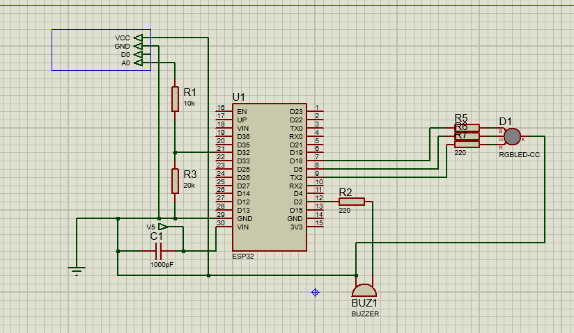
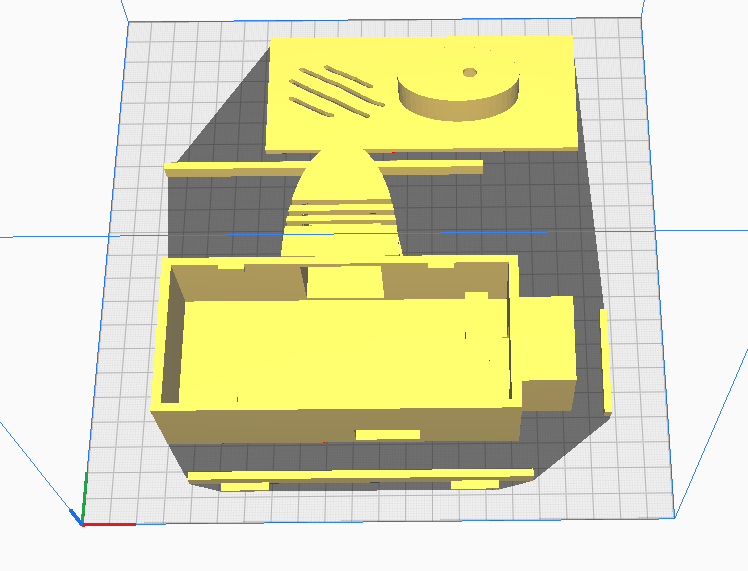

<a id="readme-top"></a>

<!-- PROJECT SHIELDS -->
<!--
[![Contributors][contributors-shield]][contributors-url]
[![Forks][forks-shield]][forks-url]
[![Stargazers][stars-shield]][stars-url]
[![Issues][issues-shield]][issues-url]
[![License][license-shield]][license-url]
-->
<!-- PROJECT LOGO -->
<br />
<div align="center">
  
  

  <p align="center">
    Sistema de monitoreo de gas con ESP32 y base de datos web
    <br />
    <br />
    <a href="#acerca-del-proyecto">Acerca del Proyecto</a>
    &middot;
    <a href="#esquematico">Esquematico</a>
    &middot;
     <a href="#tecnologías-utilizadas">Tecnologías utilizadas</a>
    &middot;
     <a href="#funcionamiento">Funcionamiento</a>
    &middot;
     <a href="#interfaz-web">Interfaz Web</a>
    &middot;
    <a href="#instalación">Instalación</a>
  </p>
</div>

## Tabla de Contenidos
<!--
<details>
  <summary>Click para expandir</summary>
  <ol>
    <li><a href="#acerca-del-proyecto">Acerca del Proyecto</a></li>
    <li><a href="#tecnologias">Esquematico</a></li>
    <li><a href="#inicio">Funcionamiento</a></li>
    <li><a href="#uso">Interfaz Web</a></li>
    <li><a href="#roadmap">Roadmap</a></li>
    <li><a href="#contribuir">Contribuir</a></li>
    <li><a href="#licencia">Licencia</a></li>
    <li><a href="#contacto">Contacto</a></li>
  </ol>
</details>
-->

##  Acerca del Proyecto

GasMonitor es un proyecto desarrollado con el objetivo de comprender el manejo de bases de datos mediante una aplicación web, integrando hardware y software.

El sistema consiste en:

- Un sensor de gas MQ-9 conectado a una ESP32
- Indicadores físicos:
  - LED RGB
  - Buzzer
- Comunicación cliente-servidor
- Registro de datos en base de datos

### Esquematico
<div align="center">
  
</div>

## Tecnologías Utilizadas

- ESP32
- Sensor MQ-9
- PHP
- HTML
- MySQL / Base de datos
- Comunicación HTTP

###  Funcionamiento

- La ESP32 actúa como cliente
- Envía el valor del ratio de gas al servidor cuando:
  - Se supera el umbral de alarma
  - Se activa o desactiva la alerta
- El servidor:
  - Registra el valor del ratio
  - Guarda fecha y hora
  - Clasifica el evento como:
    - Alarma
    - Peligro
### modelo 3D
 

###  Interfaz Web

- Sistema de login
- Visualización de datos registrados
- Historial de eventos de gas

Este proyecto permite entender:
- Envío de datos desde dispositivos IoT
- Manejo de bases de datos
- Desarrollo web 

### Prerrequisitos

- Arduino IDE o PlatformIO
- Servidor local (Laragon)
- Base de datos SQL (Laragon)

### Instalación

1. Clonar el repositorio

```sh
git clone https://github.com/Blinx87043/Gas-monitor
